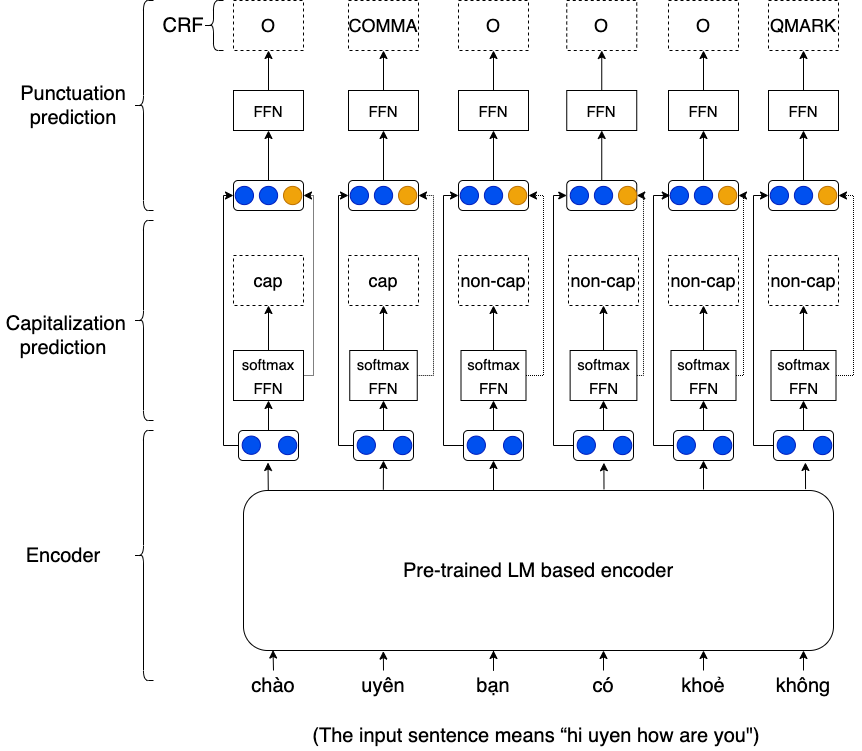
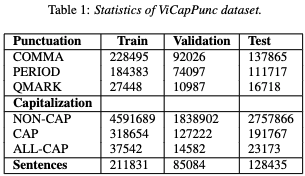

# JointCapPunc: Joint Capitalization and Punctuation Recovery

- We propose a joint model (namely, JointCapPunc) for capitalization and punctuation recorvering, that based on pretrained language model. 
- We also introduce the public capitalization and punctuation recovery dataset for Vietnamese.

<p align="center">	

</p>


Details of our JointCapPunc model architecture, dataset  [following paper](#):


## Dataset

<p align="center">	

</p>

## Model installation, training and evaluation

### Installation
- Python version >= 3.6
- PyTorch version >= 1.6

```
    git clone https://github.com/anhtunguyen98/JointCapPunc.git
    cd JointCapPunc/
    pip install -r requirements.txt
```

### Training and Evaluation
Run the following two bash files:
```
   bash train_electra.sh
   bash train_xlm.sh
```


